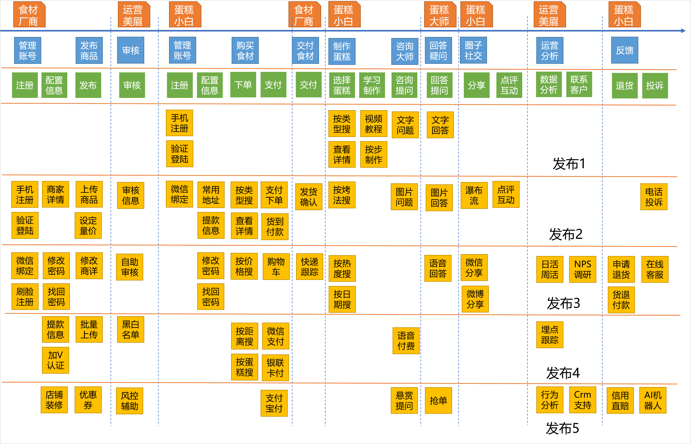

## 用户故事地图

### 1.方案标题：

用户故事地图

### 2.SOP：

* 目的：为了更好地组织和呈现用户故事，提供一个可视化的工具以捕捉产品的大图，并确保产品团队对产品的目标和优先级有共同的理解。
* 范围：适用于产品需求收集、产品迭代计划和产品团队之间的沟通。
* 流程：
	* 前置条件：已经收集了一定数量的用户故事。
	* 操作步骤：
		1. 确定目标：明确用户故事地图的目的，例如，是否用于产品发展规划、迭代计划或是团队沟通。
		2. 梳理用户活动：从高层次描述用户在产品中的主要活动或任务。
		3. 编写用户任务：针对每个用户活动，细化具体的任务。
		4. 整理用户故事：在每个任务下，归纳相关的用户故事。
		5. 定义优先级：根据商业价值和技术难度对用户故事进行排序。
		6. 呈现和分享：利用工具或物理看板展示用户故事地图，并与团队进行分享。
* 后续操作：根据产品的发展和需求变化，定期更新用户故事地图。

### 3.参考资料：

* 《用户故事地图》书籍
* 相关在线工具的官方文档

### 4.完成标准：

* 用户故事地图完整呈现了产品的大图，各个用户故事与活动和任务有明确的关联。
* 所有的用户故事都有明确的优先级。

### 5.实施风险：

#### 5.1 故事缺失风险

* 风险描述：可能存在尚未捕捉或考虑的用户故事。
* 应对策略：持续进行用户研究和访谈，鼓励团队成员提出可能的用户故事。

### 6.参与方：

* `Dev`
* `Test`
* `SM`
* `PO`

### 7.考核结果：

* 考核标准：用户故事地图能够准确反映产品的发展规划和团队的共同理解。
* 考核方法：每次迭代评审或项目重大里程碑时，检查用户故事地图，确保其与实际项目目标相符。
* 反馈与改进：收集团队与关键干系人的反馈，根据产品发展对用户故事地图进行调整。

### 8.样例

### 9.责任人：

指定方案实施、监督和考核的主要负责人。

### 10.修订记录：

* 20230911: 丁克斌初始化